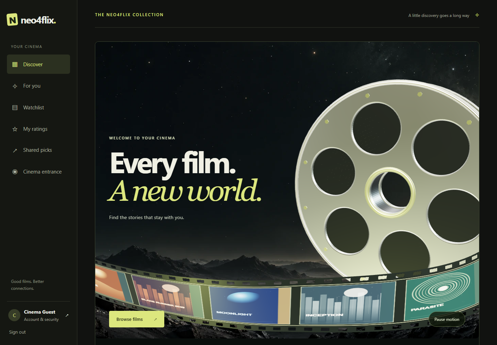
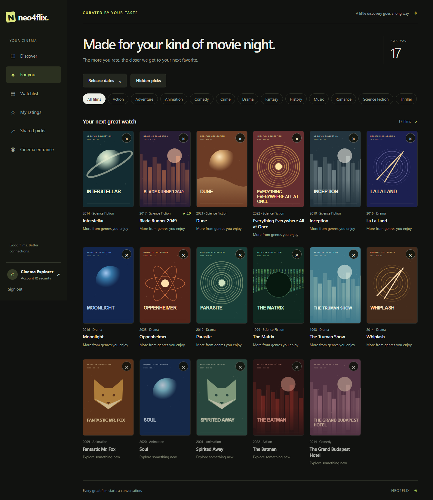
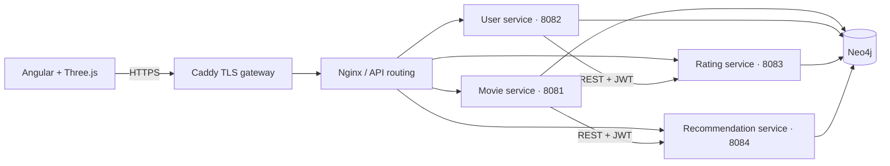
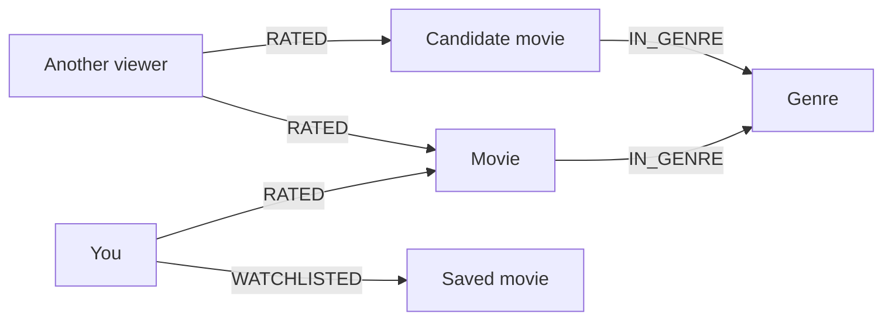

<div align="center">

# Neo4flix

### Movie discovery, powered by connections.

An Angular movie app with four Spring Boot microservices, Neo4j recommendations, and an interactive 3D cinema experience.


[Quick start](#quick-start) · [Architecture](#architecture) · [Recommendations](#how-recommendations-work) · [API reference](docs/api.md) · [Testing](#testing)


*Recorded from the running application. The animation is rendered live with Three.js.*

</div>

Neo4flix turns movie ratings into a personalized discovery experience. Browse an 18-film starter catalogue, save a watchlist, rate what you have seen, and find new films through shared interests in a graph. The project brings together graph modelling, REST microservices, authentication, frontend design, and container deployment.

It is a movie recommendation application; movie playback is outside its scope. The repository runs locally with Docker and includes configuration for deployment to your own server.

## What you can do

| Feature | Experience |
| --- | --- |
| **Discover films** | Search by title, genre, or year; combine genre and release-date filters. |
| **Explore the details** | Read a synopsis, director, runtime, release date, actual average rating, and related picks. |
| **Build your taste profile** | Create, update, and delete 1–5 ratings with private notes. |
| **Get recommendations** | See graph-based suggestions with reasons, filter the results, and hide or restore picks. |
| **Keep a watchlist** | Save films to a persistent collection attached to your account. |
| **Share a recommendation** | Create a link with a note, then copy it for a friend; update or revoke your links. Recipients sign in to view them. |
| **Manage your account** | Edit your profile, change your password, enable authenticator-app 2FA, or delete your account. |
| **Administer the catalogue** | Administrators can add, edit, and remove films. |
| **Inspect the graph** | Administrators can explore live Movie, Genre and User nodes with rating values and timestamps. |

The public entrance and signed-in Discover page share a real 3D reel, a moving film strip, and a camera transition through the reel's centre. Mobile has its own composition. Pause controls, reduced-motion preferences, keyboard access, and a static fallback keep the catalogue accessible.

<details>
<summary><strong>See the application screenshots</strong></summary>

### Discover



### Personalized recommendations



Screenshots use isolated demonstration accounts. The geometric artwork is original project artwork, rather than official movie posters.

</details>

## Quick start

**You need:** Git and Docker Desktop in Linux-container mode, or Docker Engine with Compose 2.24.4+. Allow about **5 GB of available Docker memory** for the full stack. The container build supplies Java, Maven, and Node; you do not need to install them separately to run the application.

### Windows · PowerShell

Open Docker Desktop, then run:

```powershell
git clone https://github.com/hujaafar/neo4flix.git
cd neo4flix
.\scripts\start.ps1 -TrustLocalCertificate
```

The Windows helper generates secrets, builds the services, waits for health checks, and verifies HTTPS. `-TrustLocalCertificate` imports the running gateway's development CA into your Windows account; omit the switch if you prefer to manage local trust yourself.

### macOS / Linux

```bash
git clone https://github.com/hujaafar/neo4flix.git
cd neo4flix
sh scripts/setup.sh
docker compose up --build -d
docker compose ps
```

Once the services are healthy, open **[https://localhost:8443](https://localhost:8443)** and create an account. The first build downloads dependencies and may take several minutes. The HTTP endpoint on port `8080` redirects to HTTPS.

Setup generates unique database/admin passwords, an RSA signing key pair, and an encryption key. It preserves existing configuration on subsequent runs. These values live in the ignored `.env` and `secrets/` paths.

<details>
<summary><strong>First launch: trust the local HTTPS certificate</strong></summary>

Caddy uses a local certificate authority for development. If the browser reports `ERR_CERT_AUTHORITY_INVALID`, export the CA after the gateway starts:

```powershell
docker compose cp gateway:/data/caddy/pki/authorities/local/root.crt ./secrets/local-ca.crt
```

On Windows, inspect the exported certificate and import it into your user account's trusted root store:

```powershell
Import-Certificate -FilePath .\secrets\local-ca.crt -CertStoreLocation Cert:\CurrentUser\Root
```

Restart the browser. On macOS/Linux, import that exported CA into the appropriate OS/browser trust store. This is a development CA; a public deployment uses Caddy's public certificate configuration. See [deployment details](docs/deployment.md).

</details>

### Your first movie night

1. Register a normal account and browse the collection.
2. Open a film, give it a rating, and optionally add private notes.
3. Visit **For you** to see recommendations informed by your ratings.
4. Save a film to **Watchlist**, or use **Share this film** to create a link.
5. Enable an authenticator under **Account & security** if you want 2FA.

The default administrator email is `admin@neo4flix.local`. Its generated password is the `ADMIN_PASSWORD` value in your private `.env`. Registration always creates a normal user; it cannot grant administrator access.

If another project uses port 8443, set `HTTPS_PORT=9443`, `HTTP_PORT=9080` and `APP_ORIGIN=https://localhost:9443` together in `.env`, then rerun the startup helper. Open the URL printed by the helper. For browser tests, also set `NEO4FLIX_TEST_URL` to that URL.

### Starting again later

From the repository folder:

```bash
# Start existing containers
docker compose up -d

# Rebuild after source changes
docker compose up --build -d

# Inspect status or follow logs
docker compose ps
docker compose logs -f user-service

# Stop while retaining the graph and local certificates
docker compose down
```

## Architecture



| Component | Responsibility |
| --- | --- |
| **Movie service** | Catalogue CRUD, search, genre relationships, related films, and seed data. |
| **User service** | Accounts, login, refresh sessions, profiles, 2FA, and watchlists. |
| **Rating service** | User-owned ratings, private reviews, and rating timestamps. |
| **Recommendation service** | Candidate ranking, explanations, hidden picks, and shared recommendations. |
| **Common module** | Graph access, JWT validation, REST clients, consistent errors, and health checks. |
| **Angular frontend** | Standalone pages, account workflows, movie browsing, and the 3D cinema scene. |
| **Caddy + Nginx** | HTTPS termination, static delivery, auth throttling, and API routing. |

The services run independently but deliberately share one Neo4j graph for cross-domain traversal. They communicate through REST when delegating application operations. This trades database-level service isolation for a consistent recommendation model; [the architecture notes](docs/architecture.md) explain the ownership boundaries and scaling implications.

Only Caddy's local ports are published, bound to loopback. Internal service traffic uses HTTP/Bolt on private Docker networks. Multi-host deployments require additional internal TLS configuration.

## How recommendations work

The graph connects people, films, and genres:



Recommendations combine three signals:

1. **Shared taste:** find viewers who also gave at least 4 stars to films you liked. Neo4j GDS `gds.similarity.jaccard` compares the two sets of liked films; closer peers contribute more to candidates they liked.
2. **Genre affinity:** follow the genres of your liked films to new candidates.
3. **Audience prior:** blend actual ratings with a modest prior so new users and unrated films still get useful starting results.

```text
ranking score = 3 × sum of contributing peers' Jaccard similarities
              + 1.5 × distinct liked genres
              + (sum of candidate ratings + 15) / (rating count + 5)
```

Already-rated and hidden films are excluded. Genre/date filters apply before ranking; movie title breaks score ties. The score is a ranking signal, not a predicted rating or a match percentage. New accounts start from the audience prior without fabricated personal activity.

See the [graph design](docs/architecture.md) and [recommendation implementation](recommendation-service/src/main/java/io/neo4flix/recommendation/RecommendationController.java).

The database image includes **GDS 2.13.4**, pinned by SHA-256 for Neo4j 5.26. **Neo4j-OGM 5.0.8** maps Movie, User and Genre nodes and RATED relationship entities. Movie metadata/genre writes and rating CRUD use real OGM sessions; explicit Cypher remains useful for security transactions and aggregate queries. Administrators can open **Database graph** to inspect bounded live graph data, including rating values and timestamps, without exposing credentials or private notes.

## Security

- **RS256 JWT authentication** with role checks; access tokens stay in browser memory.
- **Rotating refresh cookies** with `Secure`, `HttpOnly`, `SameSite=Strict`, and server-side replay detection.
- **BCrypt password hashing** with a 12-character minimum and complexity checks.
- **Optional TOTP 2FA**, encrypted authenticator secrets, expiring enrollment, and code replay prevention.
- **Account-scoped access** for ratings, watchlists, hidden picks, and shared links.
- **Parameterized Cypher**, validated inputs, login throttling, strict Origin checks, and a content security policy.
- **Private signing keys only in the user service**; non-root, restricted backend containers.

Security changes and logout revoke existing account sessions. Private rating notes are not exposed through shared recommendations. See [API behavior and security contracts](docs/api.md).

## Testing

The fresh Docker rebuild passed **14 unit tests**, **58 live HTTPS API assertions**, **700 bounded stress requests**, and **all 14 desktop/mobile browser scenarios** on **14 September 2026**. Browser certificate validation was enabled. Windows and the in-app browser also opened the local HTTPS site successfully. These are recorded development results, not a live CI badge. The [validation report](docs/validation.md) records individual runs, fixes, reruns, and limitations.

### Backend

The Docker backend build runs `mvn verify`. With JDK 17+ and Maven installed, you can also run:

```bash
mvn verify
```

### Integration API

Start the stack and export the local CA as described above, then run:

```bash
docker compose run --rm test-api
```

This suite creates and removes test accounts in a development database. It exercises authentication, authorization, ratings, recommendations, watchlists, sharing, refresh replay, and 2FA. The report is written to `test-results/api-results.json`.

### Bounded stress test

```bash
docker compose run --rm test-stress
```

The development-only harness sends 700 mixed requests at 4, 8 and 16 concurrent workers. One quarter update a single account's rating, exercising lock contention. It checks response contents, latency, rating uniqueness and account cleanup, and stops escalation if a stage fails. Results go to `test-results/stress-results.json`; this small-catalogue run is not a production capacity benchmark.

### Browser

With Node 22.12+ in Angular 21's supported range:

```bash
cd frontend
npm ci
npx playwright install chromium
npm run test:e2e
```

Playwright covers desktop/mobile account journeys, actual movie actions, motion, keyboard access, reduced motion, WebGL fallback, and renderer cleanup. Artifacts are saved under `frontend/test-results/`. HTTPS certificate validation is enabled in every browser context. Trust the exported development CA before running the suite; on Windows, `scripts/start.ps1 -TrustLocalCertificate` handles browser trust. Node-based test requests also need `NODE_EXTRA_CA_CERTS` set to the absolute path of `secrets/local-ca.crt` before starting Playwright. If an HTTPS inspection proxy is present, use a PEM file containing both the development CA and your already trusted proxy CA.

If Chrome is already installed, set `NEO4FLIX_BROWSER_CHANNEL=chrome` instead of downloading Playwright's browser. In PowerShell: `$env:NEO4FLIX_BROWSER_CHANNEL='chrome'`. The administrator graph scenario uses the local `.env` bootstrap credentials and disables traces. Run this suite on the generated development stack, with 2FA disabled for that test administrator.

## Development

From `frontend/`:

```bash
npm ci
npm run build
npm run format
npm run format:check
```

Prettier formats the editable TypeScript, Angular templates, JavaScript, CSS, Java, XML, and YAML. `.gitattributes` keeps source files at LF on Windows checkouts. The optional Python test formatter is installed with `python -m pip install -r requirements-dev.txt`; run `python -m ruff format tests` from the repository root.

The shared 3D source is [`frontend/src/cinema/reel-world.js`](frontend/src/cinema/reel-world.js). Build/start hooks generate its browser bundle automatically. The Angular wrapper disposes the scene's listeners, observers, frame loop, and GPU resources when leaving the feature. Edit the source rather than the generated bundle.

`npm start` prepares an Angular development server for asset work. The complete app uses Docker's same-origin HTTPS gateway and the running APIs.

## Project structure

```text
neo4flix/
├── common/                    Shared Java infrastructure and security
├── movie-service/             Catalogue, search, and seeding
├── user-service/              Authentication, profiles, 2FA, and watchlists
├── rating-service/            Ratings and private notes
├── recommendation-service/    Graph recommendations and sharing
├── frontend/
│   ├── src/                   Angular pages and live Three.js renderer
│   ├── public/                Original artwork and public cinema entrance
│   └── tests/                 Playwright desktop/mobile scenarios
├── infra/                     Caddy development/production configuration
├── scripts/                   Secret generation and setup commands
├── tests/                     HTTPS API integration suite
├── docs/                      Architecture, APIs, deployment, and validation
└── compose.yaml               Local application stack
```

## Troubleshooting

| Symptom | What to check |
| --- | --- |
| Docker daemon cannot be reached | Open Docker Desktop and wait for its Linux engine to start. |
| Compose reports missing environment values | Run the platform's setup script from the repository folder. |
| Browser rejects the HTTPS certificate | Export and trust the local CA, then restart the browser. |
| Gateway returns an error immediately after startup | Check `docker compose ps` and service logs while health checks finish. |
| Your changes are not visible | Run `docker compose up --build -d`, then reload the browser. |

## Deployment and documentation

| Guide | Contents |
| --- | --- |
| [Deployment](docs/deployment.md) | Public domain, production Compose override, TLS, backups, and traffic boundaries. |
| [Architecture](docs/architecture.md) | Graph schema, service ownership, ranking, and scaling tradeoffs. |
| [API reference](docs/api.md) | Endpoints, request bodies, responses, and access rules. |
| [Cinema integration](docs/scroll-craft.md) | Scroll-craft, Three.js lifecycle, accessibility, and asset handling. |
| [Validation](docs/validation.md) | Test coverage, recorded results, and practical limits. |
| [Evaluation walkthrough](docs/evaluation.md) | Demonstration steps, graph/algorithm explanation and human evaluation questions. |

A public deployment needs your own host, domain, DNS, and secrets. Caddy's production configuration obtains public certificates. Email verification, password-reset delivery, 2FA recovery, high availability, and large-catalogue query optimization remain future work.

## Acknowledgements

- [Scroll-craft](https://github.com/nateherkai/scroll-craft) supplies the design skill and unchanged scroll runtime; its MIT license is included.
- [Three.js](https://threejs.org/) renders the live cinema scene; its MIT license is included.
- The film artwork and scene code are original project work. The landscape was generated for Neo4flix; [asset provenance](scrollcraft/builds/neo4flix/REPORT.md) documents the process.

Built by [@hujaafar](https://github.com/hujaafar).
