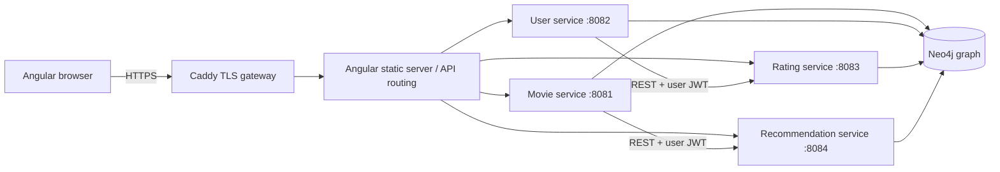

# Neo4flix

## Readable source and formatting

The editable Angular templates, TypeScript, CSS, Java, XML and YAML use normal indentation and line breaks. To keep them formatted, run these commands from `frontend/`:

```sh
npm run format
npm run format:check
```

The repository's `.prettierrc.cjs`, `.prettierignore` and `.editorconfig` record the rules. Prettier and its Java/XML plugins are pinned in the frontend toolchain. Run `npm ci` there after extracting a fresh copy. Editors with Prettier support can use this configuration for formatting on save.

The optional Python API test uses Ruff: install `requirements-dev.txt`, then run `python -m ruff format tests/integration.py` from the repository root. Generated bundles such as `frontend/public/experience/reel-world.js` are compressed by the build; edit `frontend/src/cinema/reel-world.js` instead. Dependencies, generated output and upstream vendor code are excluded from source formatting.

A movie discovery and recommendation application built with **Angular 21**, **four Spring Boot 4 services**, **Neo4j Community**, and **Docker Compose**. Java sources target Java 17; the containers run Java 21. The catalogue ships with 18 films and original geometric artwork. There are no paid APIs, external poster dependencies, or pre-seeded personal ratings.

## Start on Windows

Open PowerShell in this repository. Docker Desktop must be running in Linux-container mode. Allow approximately 5 GB of available Docker memory and enough disk space for Java, Node, Neo4j, and build images.

```powershell
.\scripts\setup.ps1
docker compose up --build -d
docker compose ps
```

Open **https://localhost:8443** and create an account. The HTTP address at http://localhost:8080 redirects to HTTPS. The first image build downloads dependencies; the frontend starts after all four APIs pass their health checks. Subsequent starts reuse the build cache and database volume.

The setup script generates an ignored `.env`, a 3072-bit RSA signing key pair, a database password, an AES key, and a random administrator password. It preserves existing configuration. If Java is unavailable, setup uses a Java Docker image. On macOS/Linux, run `sh scripts/setup.sh` instead.

### Local HTTPS certificate

Caddy issues a development certificate from its private local certificate authority. Your browser initially needs to trust that local authority. Export it with:

```powershell
docker compose cp gateway:/data/caddy/pki/authorities/local/root.crt ./secrets/local-ca.crt
```

To trust this development CA for your Windows account, inspect the certificate and, if you choose to trust it, run:

```powershell
Import-Certificate -FilePath .\secrets\local-ca.crt -CertStoreLocation Cert:\CurrentUser\Root
```

Restart the browser after importing. This command changes your account's trusted certificate authorities; setup deliberately does not run it automatically. Antivirus HTTPS inspection can replace an untrusted local certificate with its own untrusted certificate. Trusting the actual local CA may resolve that; do not disable certificate validation in the application. The Docker API tests validate the Caddy certificate directly inside the container network.

### Accounts

- Register through the UI for a normal account. All catalogue reads require login.
- Local administrator email: `admin@neo4flix.local`. Read the generated `ADMIN_PASSWORD` in your local `.env`; it is intentionally not documented or committed.
- Administrators see **Manage films**, with catalogue create, update, and delete actions.
- Account settings support display-name edits, password changes, optional authenticator-app 2FA, and permanent account deletion.
- The authenticator setup key is entered manually in a time-based authenticator account. Confirm within 10 minutes. Security changes and logout revoke every session for the account.

## Features

The **[cinema entrance](https://localhost:8443/experience/)** applies [scroll-craft](https://github.com/nateherkai/scroll-craft): a real 3D film reel, moving film strip, a camera transition through the reel, an unfolding collection, and working genre choices. Signed-out home visits open the entrance; signed-in home visits open Discover. Genre choices survive sign-in and registration. The Angular Discover page uses the same live 3D scene, with card entrances in the catalogue. Phones, keyboard navigation, reduced motion, and a static entrance fallback are supported. See [integration notes](docs/scroll-craft.md).

| Area | Available behavior |
|---|---|
| Discovery | Search by title, genre, or year; combine genre and release-date filters; paginated catalogue |
| Film details | Synopsis, director, runtime, release date, live average rating, and related films |
| Ratings | Create, read, update, and delete a 1–5 rating; private notes; creation and update timestamps |
| Recommendations | Collaborative and genre graph traversals, explainable ranking, cold-start fallback, filters, and hide/restore |
| Watchlist | Persistent account-owned collection with optional API notes; add/remove through the UI |
| Sharing | Create a link and note; signed-in friends can read it; owners can update notes and revoke links |
| Authentication | RSA-signed JWTs, role checks, rotating refresh cookies, replay detection, and account revocation |
| Security | HTTPS, password hashing, input validation, parameterized Cypher, login throttling, and encrypted TOTP secrets |
| Interface | Scroll-craft cinema entrance, responsive desktop/mobile layouts, semantic forms, keyboard focus, empty/error/loading states, and reduced-motion support |

The application recommends films; it does not stream films or send messages to friends. Sharing creates a link for the user to copy.

## Architecture



Each service is an independently runnable Spring Boot process and Docker image. Inter-service application calls use REST with the caller's bearer token, connection timeouts, and read timeouts. A shared Maven module provides database access, JWT verification, consistent errors, and health probes.

The services deliberately share one graph so recommendations can traverse users, ratings, and genres in a transaction. This is a shared-database microservice design, with service-owned writes and a shared read model; it does not provide database-level domain isolation. Neo4j Community uses one application database credential. See [the architecture notes](docs/architecture.md) for ownership and scaling tradeoffs.

Only the gateway is published on the host, bound to loopback in the local configuration. The four APIs and Neo4j are on a private Docker network. Browser traffic is HTTPS; internal traffic uses HTTP/Bolt on the isolated Docker network. For deployments across hosts, add authenticated TLS to internal connections as described in [deployment](docs/deployment.md).

## Tests

The Docker Java build runs the unit tests. To run them without Docker, install a supported JDK and Maven, then run `mvn verify` at the repository root.

After starting the stack and exporting the local CA, run the API suite:

```powershell
docker compose run --rm test-api
```

The suite creates isolated test accounts, checks real HTTP responses and graph behavior, and removes the accounts on completion. It tests authorization, ownership, malformed tokens, injection-like search text, rating concurrency, recommendation ranking, watchlists, sharing, refresh replay, password changes, TOTP, and CRUD. It saves `test-results/api-results.json`. Use a development database, since tests temporarily create real records. If interrupted, a cleanup-needed account ID is reported.

For browser checks, install Node 22.12+ within Angular 21's supported range:

```powershell
cd frontend
npm ci
npx playwright install chromium
npm run test:e2e
```

Playwright drives desktop and mobile Chromium through registration, browsing, rating, sharing, reload persistence, recommendations, and deletion. It checks horizontal overflow and JavaScript errors. Its test browser accepts the local development certificate; production code never disables TLS verification. Screenshots and traces are saved under `frontend/test-results`. This automated usability coverage does not replace feedback from real users or a professional security audit.

## Development and operations

```powershell
# Follow one service's logs
docker compose logs -f user-service

# Rebuild after changes; Nginx re-resolves service addresses
docker compose up --build -d

# Stop containers while retaining user data
docker compose down
```

Do not remove Docker volumes unless you intend to erase the graph and local certificate authority. Keep `.env`, signing keys, and the encryption key backed up securely. Replacing the encryption key makes stored authenticator secrets unreadable. Movie seeding runs once per graph; deleted seed films do not return after a restart.

To compile the Angular application independently: `cd frontend` followed by `npm ci` and `npm run build`. The normal working app runs through Docker's same-origin HTTPS gateway. `ng serve` alone is an asset-development server and is not a replacement for that gateway or the APIs.

## Deployment

A production Caddy configuration and Compose override are included. Configure your real domain, DNS, certificate contact email, secrets, backups, and `APP_ORIGIN`, then deploy to your own Docker host. Caddy obtains and renews public certificates automatically. See [deployment instructions](docs/deployment.md). Public deployment requires your host and domain and is separate from the working local deployment.

## Project map

```text
common/                    Shared graph, JWT, errors, and container probe
movie-service/             Catalogue CRUD, related films, initial data
user-service/              Users, authentication, TOTP, watchlists
rating-service/            Account-owned rating relationships
recommendation-service/    Graph ranking, hidden picks, share CRUD
frontend/                  Standalone Angular application and browser tests
infra/                     Local and production Caddy configuration
scripts/                   Secret generation and cross-platform setup
tests/                     Real HTTPS API integration checks
docs/                      API reference, graph model, deployment, and test report
```

## References

- [Neo4j graph recommendation tutorial](https://neo4j.com/docs/getting-started/cypher/recommendation-engine/)
- [Neo4j Docker operations](https://neo4j.com/docs/operations-manual/current/docker/)
- [Spring Security JWT resource server](https://docs.spring.io/spring-security/reference/servlet/oauth2/resource-server/jwt.html)
- [Angular version compatibility](https://angular.dev/reference/versions)
- [Docker Compose documentation](https://docs.docker.com/compose/)
- [RFC 6238: TOTP](https://www.rfc-editor.org/rfc/rfc6238)

Film summaries are original concise descriptions. The bundled geometric illustrations are original project artwork, not official film posters. Film names identify the works in the sample catalogue.
