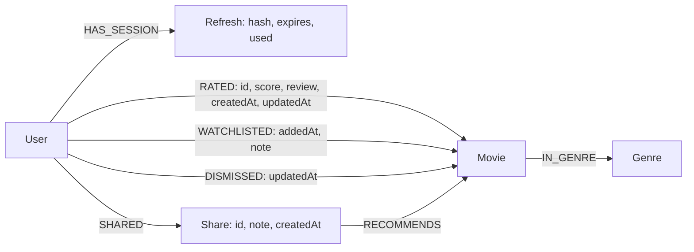

# Graph and recommendation design



Unique constraints cover user ID, normalized user email, movie ID, genre name, refresh-token hash, share ID, and the seed marker ID. Movie metadata stores a denormalized `genres` array for fast API projection; catalogue writes update that array and `IN_GENRE` relationships in one transaction. Seed data runs once per persistent graph, under a graph write lock.

## Ownership

- Movie service writes Movie/Genre nodes and `IN_GENRE`. Removing a movie intentionally removes attached ratings, watchlist, hidden-pick, and recommendation relationships.
- User service writes User/Refresh nodes and watchlists. It cascades account deletion to refresh and share nodes and detaches personal relationships.
- Rating service writes `RATED` relationships. All lookups include the JWT subject and movie ID.
- Recommendation service reads the cross-domain graph and writes `DISMISSED`/Share records.
- The common security validator reads User account status and token version on every protected request, so a cryptographically valid but revoked token cannot be used in another service.

This shared graph makes the learning objectives explicit and keeps recommendations consistent with freshly saved ratings. It trades independent database ownership for straightforward traversal. Scaling to separate databases would need independently maintained recommendation projections, versioned REST contracts, and reliable synchronization. A shared graph is not a claim of fully isolated microservices.

## Ranking

Candidates exclude movies already rated or explicitly hidden by the requesting user. Filters apply before ranking.

1. **Collaborative signal:** traverse from the user to films they rated at least 4, to peers who also rated those films at least 4, and then to candidates those peers rated at least 4. For each distinct peer, Neo4j GDS `gds.similarity.jaccard` compares the two sets of liked movie IDs. Sum those similarities for peers who like the candidate, so closer taste contributes more and several shared paths do not multiply one peer's vote.
2. **Genre signal:** traverse liked films through Genre nodes to candidates, counting distinct shared genres.
3. **Prior-weighted audience average:** blend observed ratings with five prior observations at score 3. This gives new users and unrated movies a deterministic starting point without inventing audience ratings.

```text
score = 3 × sum_of_contributing_peers_jaccard_similarities
      + 1.5 × distinct_liked_genres
      + (sum_of_candidate_ratings + 3 × 5) / (rating_count + 5)
```

Sort by score descending, breaking ties by movie title. Explanations prioritize the collaborative signal, then genre affinity, then discovery. The numeric score is an internal ranking measure, not a probability, match percentage, or predicted star rating. Personal preferences arise from ratings; the application does not fabricate activity for a new account.

The concrete Cypher lives in `RecommendationController.java`; it uses parameterized values and distinct aggregates in subqueries to avoid multiplying rating counts through joined paths. Movie details compute actual averages from the current `RATED` relationships. Related films use genre overlap and audience average.

For example, Alice likes `{Inception, The Matrix}` and Bob likes `{Inception, Interstellar}`. Their intersection has one film and their union has three, so GDS returns `1/3`. Bob contributes `1/3` to Interstellar's collaborative score. The API integration test checks this exact result. Cold-start users have no peers and receive the audience prior. This uses the GDS similarity function directly on catalogue sets; it does not create a named graph projection on every request.

## Object graph mapping

Neo4j-OGM 5.0.8 uses annotated `MovieNode`, `GenreNode`, `UserNode` and `RatingRelationship` classes. Movie metadata and genre relationships, plus rating CRUD and history, use real OGM transactions. UUID business IDs map existing graph data without a destructive migration. `RATED` is a relationship entity carrying its ID, score, private review and timestamps; `IN_GENRE` maps the movie-to-genre relationship.

Each transaction opens its own OGM session. Movie updates load the complete genre collection before replacing it, so removed genres do not leave stale edges. Rating upserts take a user write lock before reading the OGM snapshot, which serializes concurrent writes for one account. The minimal mapped User does not include authentication properties; rating writes must not overwrite password hashes, roles or 2FA state. DTO projections explicitly select response fields. Authentication, account cascades and aggregate recommendation queries still use the native driver and parameterized Cypher, sharing the Spring-managed connection pool.

Neo4j can abort a transaction to resolve a deadlock. The OGM wrapper retries that transient failure up to five total attempts, with a fresh session and short randomized backoff. Application errors are not retried. Exhausted retries produce a generic 503 rather than exposing database internals. The API suite and stress harness exercise concurrent rating writes; unit tests verify rollback/session cleanup and error classification.

The Docker database image pins GDS 2.13.4 with a SHA-256 checksum, compatible with Neo4j 5.26. Its health probe executes the installed GDS function. Administrator-only `/api/movies/graph` supplies the **Database graph** page with at most 40 movies and 25 users plus their genres and ratings. User labels are pseudonyms; emails, credentials and private rating notes are excluded. This is a bounded live view, not an export of every database record.

## Security boundaries

RSA private signing material is mounted only in the user service. Other services receive the public key. Only validated JWT claims authorize roles; registration cannot choose a role. Browser access tokens remain in memory, while hashed refresh credentials and their replay state live in Neo4j. BCrypt protects passwords; AES-256-GCM protects authenticator secrets with fresh nonces and authenticated ciphertext.

All personal access is scoped to the verified subject. Shared picks are a separate opt-in disclosure: an authenticated holder of the unguessable link can read the deliberately shared movie and note. Private rating notes never appear on the share or catalogue endpoints. API errors do not return stack traces or query text.

Origin checks apply to every auth POST. Nginx also limits auth traffic; Caddy controls the forwarded client header used as the rate-limit key and is the only external entry point. The local configuration binds to loopback, hides database ports, and puts graph/API traffic on an internal network. Application containers drop capabilities, run as a non-root account with a read-only filesystem, and have memory limits.

## Practical limits

This is a complete local coursework implementation, not a claim of production certification. Recommendations currently traverse the candidate graph for each request, suitable for a small catalogue. Large catalogues need query profiling, bounded neighborhoods, precomputed candidates, pagination of personal collections, and workload-specific indexes. Failed-login lockout is account based plus gateway IP throttling, so intentional lockout denial-of-service remains a tradeoff. TOTP account recovery, email verification, password-reset delivery, key rotation automation, distributed abuse prevention, high availability, and backups need an operating plan before a public launch.

References: [Neo4j-OGM reference](https://neo4j.com/docs/ogm-manual/current/reference/), [GDS similarity functions](https://neo4j.com/docs/graph-data-science/current/algorithms/similarity-functions/), [GDS compatibility](https://neo4j.com/docs/graph-data-science/current/installation/supported-neo4j-versions/), [Spring JWT validation](https://docs.spring.io/spring-security/reference/servlet/oauth2/resource-server/jwt.html), [TOTP specification](https://www.rfc-editor.org/rfc/rfc6238).
